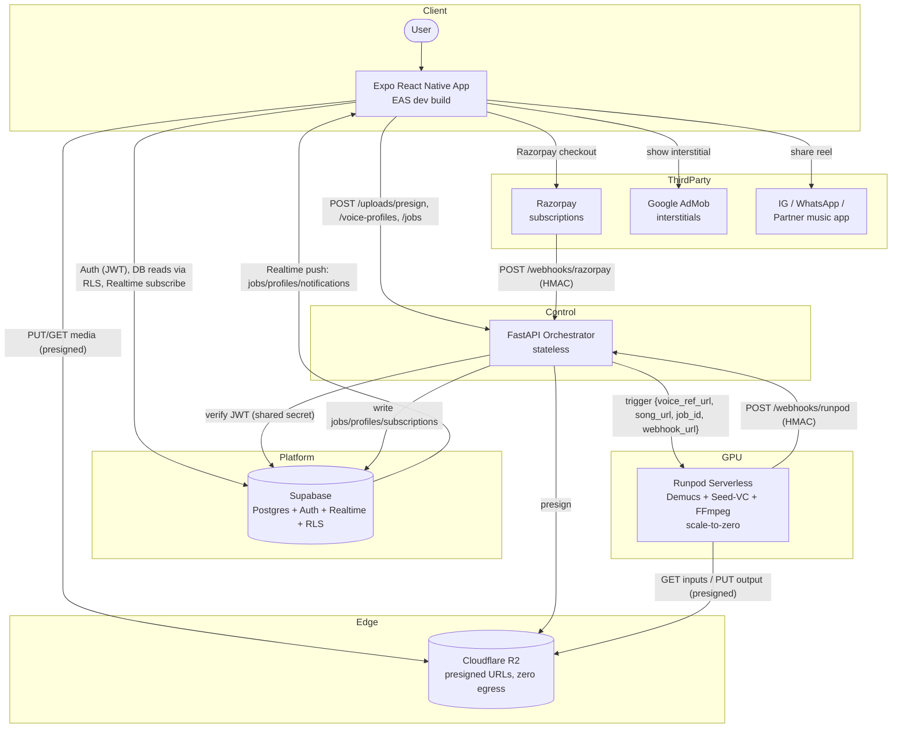
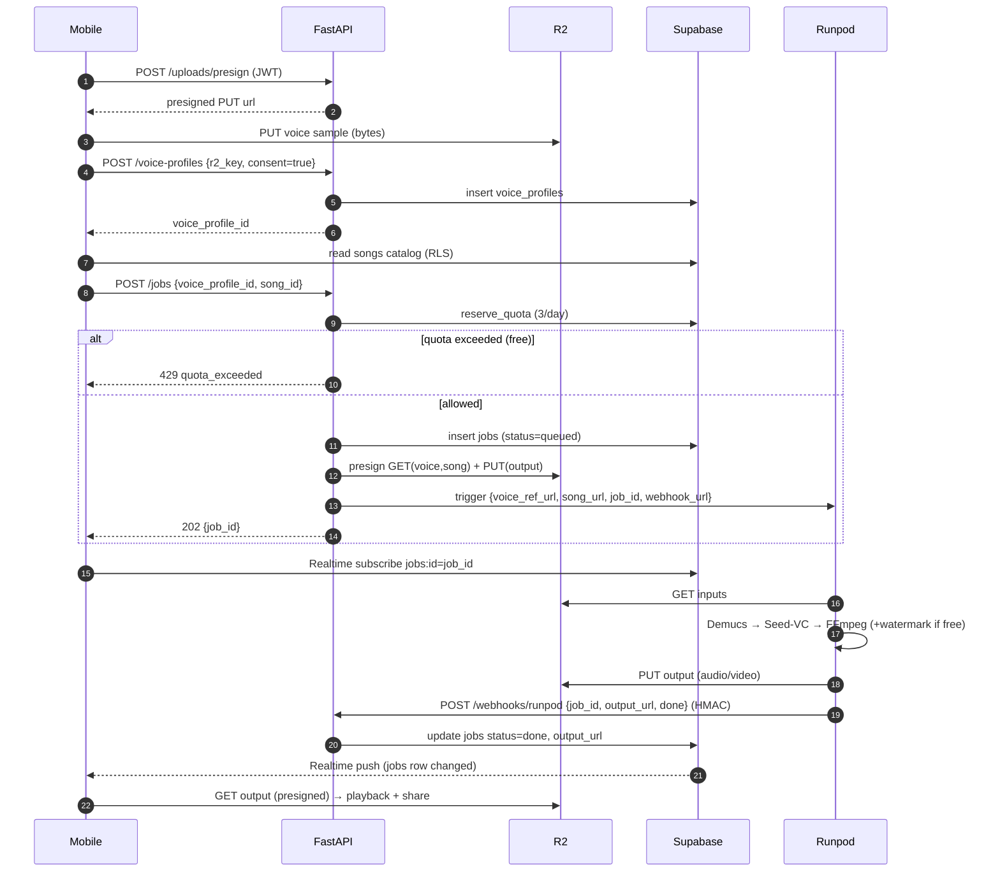
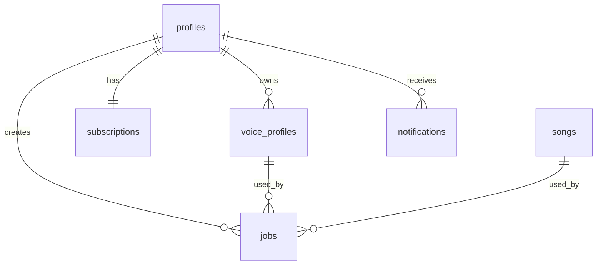

# RealMVP — High-Level Design (HLD)

**Status:** Phase 1 MVP design · **Date:** 2026-06-08 · **Owner:** Architecture
**Scope:** Greenfield mobile AI voice-cloning & singing app

---

## 1. Executive Summary & Goals / Non-Goals

RealMVP lets a user record 30–60s of their own voice, clones it zero-shot, and produces a shareable "AI cover" where their cloned voice sings any licensed song. The user never sings — we take the original track's vocal stem and convert its *timbre* to the user's voice while preserving the original melody, pitch, and timing.

**The product bet rests on two loops:**
- **Viral hook:** record → hear *yourself* singing in ~60s. Onboarding-to-magic must be sub-90s wall-clock.
- **Viral loop:** one-tap share of finished covers to Instagram Reels, WhatsApp, and a partner music app.

The system is deliberately small: a **stateless FastAPI orchestrator**, **Supabase** (Postgres + Auth + Realtime) as the system of record and live transport, **Cloudflare R2** for all media, and a **Runpod Serverless GPU endpoint** that runs the `Demucs → Seed-VC → FFmpeg` pipeline and scales to zero. No always-on GPU, no Celery, no Redis.

### Goals (Phase 1)
- Zero-shot voice clone from a single 30–60s sample (no per-user training).
- Generate an AI cover (timbre-converted vocal remixed over instrumental) in a tolerable, demo-ready window.
- Live processing status, profiles, and notifications via Supabase Realtime.
- Free tier: 3 covers/day, watermarked, AdMob interstitial. Premium (₹99–149/mo via Razorpay): unlimited, no watermark.
- Legal-by-construction: only the user's own voice, only a licensed/public-domain song catalog.

### Non-Goals (Phase 1)
- No high-fidelity per-user trained voices (RVC) — that is a Phase 2 "Pro Voice" lever.
- No regional-language dubbing (Telugu/etc.) — Phase 2/3 research, blocked on model availability (see §11).
- No real-time/streaming voice conversion — jobs are batch.
- No social graph, feed, comments, or in-app marketplace in Phase 1.

### Assumptions (stated, not asked)
| Dimension | Phase 1 assumption | Why it matters |
|---|---|---|
| Scale | 10k–50k installs, ~2k DAU, peak ~50–100 cover jobs/hour | Single Postgres primary + scale-to-zero GPU is plenty |
| Job latency | 30–90s p50 end-to-end (incl. cold start); ≤3 min p95 | Hidden behind a "processing" screen + ad slot |
| Job duration on GPU | 15–40s active compute per cover (RTX 4090 class) | Drives per-cover cost (cents) |
| Consistency | Strong within a user's rows (Postgres + RLS); job status eventually-consistent via Realtime | Pipeline is async |
| Workload shape | Bursty, write-light, media-heavy | Justifies serverless GPU + object storage |
| Region | India-first (Razorpay, INR pricing), single primary region | Multi-region deferred |

---

## 2. System Context Diagram



**Key topology decisions:**
- The mobile app talks to **three** backends directly: Supabase (auth/reads/realtime), R2 (media bytes), and the API (mutations needing server authority). Large media and read traffic never funnel through FastAPI.
- The API never touches media bytes — it only mints presigned URLs and orchestrates. R2 is the data plane; API is the control plane.
- Supabase Realtime, not the API, is the live transport to the client. Job completion is a *Postgres write*; the push to the device is a side effect of CDC on that row.

---

## 3. Component Breakdown & Responsibilities

### 3.1 Mobile App — `apps/mobile` (Expo RN, TypeScript)
Owns the entire UX and the viral loop. Core screens: **Record**, **Pick Song / Create**, **Processing**, **Playback + Share**, **Profile**.
- Auth via `@supabase/supabase-js` (Supabase Auth holds the session; JWT attached to API calls).
- Capture 30–60s audio, **PUT directly to R2** via a presigned URL (bytes never transit the API).
- Read the licensed `songs` catalog and the user's own `voice_profiles`/`jobs` directly from Postgres under RLS.
- Subscribe to the user's in-flight `jobs` row via Realtime; show live status; AdMob interstitial in the processing window (free tier).
- Playback (`expo-av`) and native share (`expo-sharing` / `react-native-share`).

> AdMob + native share require an **EAS dev/custom build, not Expo Go** — baked in from M2.

### 3.2 API Orchestrator — `services/api` (FastAPI, stateless)
The only component with server-side authority. Stateless, horizontally scalable; all state in Supabase/R2.
Endpoints: `POST /uploads/presign`, `POST /voice-profiles`, `POST /jobs` (enforce free quota 3/day), `POST /webhooks/runpod`, `POST /webhooks/razorpay`.
Owns exclusively: quota enforcement, watermark decision, Runpod triggering, webhook verification, plan transitions. Reads are pushed to RLS so the API stays thin.

### 3.3 ML Worker — `ml/runpod_handler` (Python, CUDA, Runpod Serverless)
Docker image (CUDA + `demucs` + `seed-vc` + `ffmpeg`) deployed as a Runpod Serverless endpoint. Stateless, pay-per-second, scales to zero. Pipeline per job: download inputs → Demucs split → Seed-VC zero-shot timbre conversion → FFmpeg remix (+watermark for free) → optional vertical video → upload to R2 → `POST /webhooks/runpod`. Never touches Postgres — the API is the only writer of authoritative state.

### 3.4 Supabase — `infra/supabase` (Postgres + Auth + Realtime)
System of record, identity provider, and live transport. RLS on every table. Realtime on `jobs` and `notifications`. SQL migrations version-controlled.

### 3.5 External Services
- **Cloudflare R2** — all media. S3-compatible, presigned URLs, **zero egress** (viral sharing costs no bandwidth).
- **Razorpay** — premium subscriptions (₹99–149/mo), webhook-driven.
- **Google AdMob** — free-tier interstitials during the processing wait.

---

## 4. End-to-End Data & Control Flows

### 4.1 Cover Generation Flow (core loop)


### 4.2 Auth Flow
Supabase Auth issues a signed JWT on login. The client uses it for RLS-gated Postgres reads and API calls. FastAPI verifies the JWT locally with the shared Supabase JWT secret (no network round-trip on the hot path). A separate service-role key is used for privileged writes that bypass RLS.

### 4.3 Payment Flow
Razorpay checkout → on success Razorpay `POST /webhooks/razorpay` (HMAC) → API upserts `subscriptions` + flips `profiles.plan='premium'` → Realtime pushes the profile change to the device (unlock unlimited + no watermark + no ads). **The webhook is the source of truth**, not the client callback.

### 4.4 Realtime Notification Flow
Any write to a row the user owns (`jobs`, `profiles`, `notifications`) streams to the subscribed device via Supabase Realtime (logical replication → WebSocket). The client never polls.

---

## 5. Data Model Overview


Tables: `profiles`, `voice_profiles`, `songs`, `jobs`, `subscriptions`, `notifications`. `profiles.id` mirrors `auth.users.id`; RLS keys off `auth.uid()`. `songs.license_source`/catalog gating enforces the legal guardrail. Media bytes never live in Postgres — only R2 keys. See **LLD §1** for full DDL.

---

## 6. Realtime Architecture
Supabase Realtime is the live nervous system, replacing polling and a bespoke WebSocket gateway.
- **Mechanism:** Postgres logical replication (WAL) → Realtime service → authenticated WebSockets. **RLS applies to Realtime too.**
- **Job status:** client subscribes to its `jobs` row (`id=eq.<job_id>`); the Runpod webhook flips status, change streams to device sub-second. No polling.
- **Notifications & profile:** client subscribes to its `profiles` row (plan changes → unlock UI) and a `notifications` channel.
- **Why not API push:** the stateless API may scale to N replicas; holding WebSockets there needs sticky sessions/pub-sub. Offloading to Supabase keeps the API pure request/response.
- **Reconnect:** on reconnect the client one-shot reads the `jobs` row to reconcile — a dropped socket never strands a user.

---

## 7. Scaling Strategy
- **GPU (Runpod Serverless):** scale-to-zero when idle; autoscale on queue depth; Runpod's request queue *is* the job queue (why we need no Celery/Redis). The 3/day quota is a second business-level backpressure valve.
- **Cold-start mitigation:** (1) hide in the 30–60s processing UX + ad; (2) keep N≥1 warm worker during peaks/demos; (3) bake models into the image / FlashBoot.
- **API:** stateless → scale horizontally; light JSON requests, cheap replicas.
- **Postgres:** write-light; single primary fine well past Phase 1. **R2:** effectively infinite; zero egress is the virality unlock.
- **The only real bottleneck is GPU concurrency + cold-start tail latency** — the architecture exists to keep that the single thing you tune.

---

## 8. Security & Privacy
- **JWT verification** on every mutating request (HS256 shared secret).
- **RLS** on every table (`auth.uid() = user_id`); `songs` public-read, never client-writable; privileged writes use the service-role key only inside the API.
- **Presigned URLs** — short TTL, single object + method.
- **Webhook authenticity** — HMAC-verified Runpod + Razorpay webhooks.
- **Voice consent** — checkbox at record time, persisted; ToS prohibits cloning others.
- **Watermarking (free tier)** — monetization + abuse traceability.
- **Catalog gating** — licensed/public-domain/user-uploaded only; never scrape.

---

## 9. Cost Model
| Item | Estimate (per cover) |
|---|---|
| GPU compute (20–40s active) | ~₹0.3–1.5 (≈ $0.004–0.018) |
| R2 storage | fraction of a paisa/mo |
| R2 egress (downloads/shares) | **₹0 (zero egress)** |
| **All-in per cover** | **~₹1–2 / ≈ $0.01–0.02** |

Free tier (3/day) ≤ ~₹6/user/day GPU, covered by AdMob. Premium ₹99–149/mo has huge margin. Idle cost ≈ ₹0 (scale-to-zero). Zero egress makes virality cheap.

---

## 10. Technology Choices & Trade-offs
- **Seed-VC (zero-shot) over RVC:** RVC needs per-voice training (kills the instant hook). Seed-VC clones from a short sample, demo-ready. RVC kept as a Phase 2 "Pro Voice" premium upgrade.
- **Runpod Serverless over pod + Celery/Redis:** bursty GPU work; per-second billing + scale-to-zero; built-in queue deletes two stateful components.
- **Supabase over hand-rolled stack:** bundles Postgres + Auth + RLS + Realtime behind one SDK; thin API.
- **Client-direct R2 (presigned) over proxying media:** keeps API stateless and tiny.
- **REST/JSON over gRPC/GraphQL:** ~5 endpoints; reads already served by Supabase PostgREST + Realtime.

---

## 11. Key Risks & Mitigations
| Risk | Mitigation |
|---|---|
| Cold starts | Hide behind processing UX + ad; warm worker during demos; bake models into image |
| Coqui shutdown / Telugu gap (Phase 2 dubbing) | Treat as Phase 2 research, not assumed; evaluate fine-tuned/alt TTS first |
| Copyright/legal on songs | Catalog gated; `license_source` NOT NULL; never scrape |
| Voice impersonation / abuse | Consent + ToS; watermark traceability; Phase 2 liveness |
| Webhook spoofing | HMAC verification; reject unsigned |
| Runpod single-vendor | Portable Docker image; failover; jobs stay `queued` and resume |
| Quota race conditions | Atomic Postgres `reserve_quota` with row lock |
| Realtime missed events | One-shot reconcile read on reconnect |
| Expo Go limits | EAS dev build set up in M2 |

---

## 12. Phased Roadmap
- **Phase 1 (current):** Clone + Sing + Share. Auth, RLS, Realtime, R2, Razorpay, AdMob, quota + watermark. India-first.
- **Phase 2:** Pro Voice (RVC), dubbing (research-gated), marketplace, duet.
- **Phase 3:** regional-language at quality (the moat), emotion control, beat sync.

---

## Appendix — Monorepo Layout
```
realmvp/
├─ apps/mobile/                Expo RN app (Record / Pick / Processing / Share / Profile)
├─ services/api/               FastAPI orchestrator (presign, voice-profiles, jobs, webhooks)
├─ ml/runpod_handler/          Serverless GPU: Demucs + Seed-VC + FFmpeg
├─ infra/supabase/             SQL migrations: schema, RLS, realtime
└─ docs/                       HLD, LLD, coding guidelines
```
