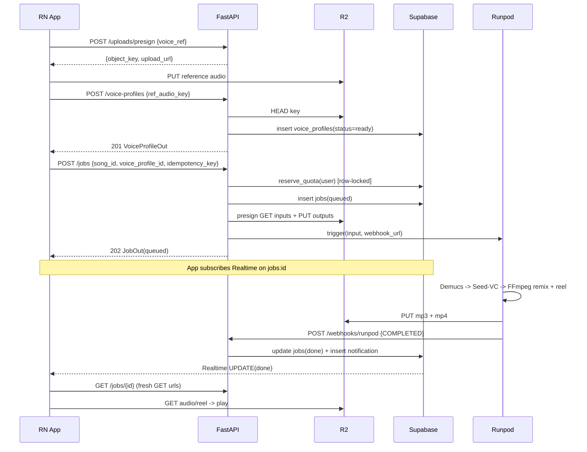
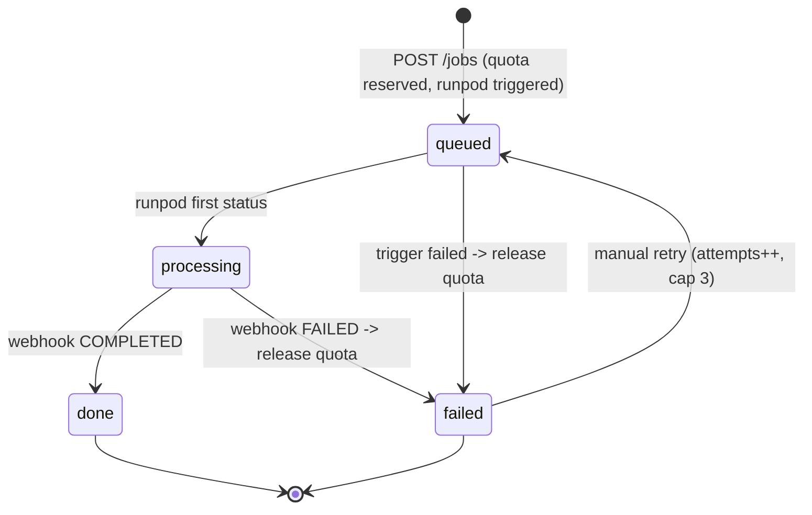

# RealMVP — Low-Level Design (LLD)

**Status:** Draft v1.0 · **Owner:** Platform Engineering · **Date:** 2026-06-08

---

## 0. Scope & Assumptions

Designs the internals of the four runtime modules: the FastAPI orchestrator, the Runpod GPU handler, the Supabase data layer (schema + RLS + Realtime), and the React Native client — at the level of classes, signatures, schemas, and contracts.

**Boundary decisions:**
- The FastAPI service is **stateless**: validate → authorize → mutate DB → trigger GPU → return. All state lives in Postgres or R2.
- **Realtime status** is delivered to the client directly by Supabase Realtime (logical replication on `jobs`/`notifications`), *not* through FastAPI.
- All R2 access from the client is via **presigned URLs**; the client never sees R2 credentials.
- The GPU handler is the only writer to R2 output keys; FastAPI flips a job to `done`/`failed` only on a verified Runpod webhook.

**Assumptions:** Free plan = 3 successful generations/UTC-day (failures don't consume quota). Reference audio 5–30s, transcoded to 24kHz mono WAV before Seed-VC. Single primary region.

---

## 1. Database Schema (Postgres / Supabase)

### 1.1 Enums
```sql
create type plan_t            as enum ('free', 'premium');
create type job_status_t      as enum ('queued', 'processing', 'done', 'failed');
create type job_kind_t        as enum ('clone_sing');
create type voice_status_t    as enum ('pending', 'ready', 'failed');
create type sub_status_t      as enum ('created', 'active', 'halted', 'cancelled', 'expired');
create type notif_type_t      as enum ('job_done', 'job_failed', 'sub_activated', 'sub_expired', 'system');
```

### 1.2 `profiles`
```sql
create table public.profiles (
  id              uuid primary key references auth.users(id) on delete cascade,
  display_name    text        not null default '',
  avatar_url      text,
  plan            plan_t      not null default 'free',
  quota_date      date        not null default (now() at time zone 'utc')::date,
  quota_used      smallint    not null default 0 check (quota_used >= 0),
  created_at      timestamptz not null default now(),
  updated_at      timestamptz not null default now()
);
create index profiles_plan_idx on public.profiles (plan);
```

### 1.3 `voice_profiles`
```sql
create table public.voice_profiles (
  id              uuid primary key default gen_random_uuid(),
  user_id         uuid        not null references public.profiles(id) on delete cascade,
  name            text        not null,
  status          voice_status_t not null default 'pending',
  ref_audio_key   text        not null,
  duration_ms     integer     check (duration_ms > 0),
  embedding_key   text,
  created_at      timestamptz not null default now(),
  updated_at      timestamptz not null default now()
);
create index voice_profiles_user_idx on public.voice_profiles (user_id, created_at desc);
```

### 1.4 `songs` (catalog)
```sql
create table public.songs (
  id              uuid primary key default gen_random_uuid(),
  title           text        not null,
  artist          text,
  cover_url       text,
  source_key      text        not null,
  vocals_key      text,
  instrumental_key text,
  duration_ms     integer     not null check (duration_ms > 0),
  license_source  text        not null,   -- legal guardrail: NOT NULL
  is_premium      boolean     not null default false,
  is_active       boolean     not null default true,
  created_at      timestamptz not null default now()
);
create index songs_active_idx on public.songs (is_active, created_at desc);
```

### 1.5 `jobs`
```sql
create table public.jobs (
  id                uuid primary key default gen_random_uuid(),
  user_id           uuid        not null references public.profiles(id) on delete cascade,
  song_id           uuid        not null references public.songs(id),
  voice_profile_id  uuid        not null references public.voice_profiles(id),
  kind              job_kind_t  not null default 'clone_sing',
  status            job_status_t not null default 'queued',
  idempotency_key   text        not null,
  runpod_job_id     text,
  attempts          smallint    not null default 0 check (attempts >= 0),
  watermark         boolean     not null default true,
  output_audio_key  text,
  output_reel_key   text,
  error_code        text,
  error_detail      text,
  quota_consumed    boolean     not null default false,
  created_at        timestamptz not null default now(),
  updated_at        timestamptz not null default now(),
  completed_at      timestamptz
);
create unique index jobs_idempotency_uidx on public.jobs (user_id, idempotency_key);
create index jobs_user_status_idx on public.jobs (user_id, status, created_at desc);
create index jobs_runpod_idx on public.jobs (runpod_job_id);
```

### 1.6 `subscriptions`
```sql
create table public.subscriptions (
  id                    uuid primary key default gen_random_uuid(),
  user_id               uuid        not null references public.profiles(id) on delete cascade,
  razorpay_sub_id       text        not null unique,
  razorpay_plan_id      text        not null,
  status                sub_status_t not null default 'created',
  current_period_end    timestamptz,
  created_at            timestamptz not null default now(),
  updated_at            timestamptz not null default now()
);
create index subscriptions_user_idx on public.subscriptions (user_id, status);
```
A trigger keeps `profiles.plan` in sync with the latest active subscription (see `infra/supabase`).

### 1.7 `notifications`
```sql
create table public.notifications (
  id          uuid primary key default gen_random_uuid(),
  user_id     uuid        not null references public.profiles(id) on delete cascade,
  type        notif_type_t not null,
  title       text        not null,
  body        text        not null default '',
  job_id      uuid        references public.jobs(id) on delete set null,
  read_at     timestamptz,
  created_at  timestamptz not null default now()
);
create index notifications_user_unread_idx on public.notifications (user_id, created_at desc) where read_at is null;
```

### 1.8 Daily quota (atomic, race-safe)
`profiles.quota_date` + `quota_used` is a lazy-reset counter. A `reserve_quota(user, limit)` SQL function takes `SELECT ... FOR UPDATE` on the profile row to serialize concurrent reservations; premium bypasses. `release_quota(user)` refunds on failure. See `infra/supabase` migration.

### 1.9 Row-Level Security (summary)
- `profiles`: self select/update (`auth.uid() = id`).
- `voice_profiles`: full CRUD scoped to owner.
- `songs`: readable by any authenticated user (`is_active = true`); no client writes.
- `jobs` / `subscriptions`: owner **select only** — NO client insert/update; all writes via service-role inside the API.
- `notifications`: owner select + update (mark read).
- Realtime: `alter publication supabase_realtime add table public.jobs, public.notifications;`

---

## 2. API Contract (FastAPI)

**Conventions:** non-webhook endpoints require `Authorization: Bearer <supabase-jwt>` → injects `Principal(user_id, plan)`. Error envelope: `{"error": {"code", "message", "details"}}`. Status codes: 200 read/replay, 201 created, 202 accepted, 400/401/403/404/409/422/429, 502/503 upstream.

| Endpoint | Method | Auth | Notes |
|---|---|---|---|
| `/uploads/presign` | POST | JWT | Returns presigned PUT; server generates `object_key` (`voice_ref/{user}/{uuid}.wav`). |
| `/voice-profiles` | POST | JWT | HEAD-checks the uploaded object exists; inserts row. |
| `/voice-profiles` | GET | JWT | List user's profiles, newest-first. |
| `/songs` | GET | JWT | Cursor-paginated catalog. |
| `/jobs` | POST | JWT | Quota check → insert job (queued) → presign IO → trigger Runpod. 202/200(replay)/429. |
| `/jobs/{id}` | GET | JWT | Returns job + fresh presigned GET URLs if done. |
| `/webhooks/runpod` | POST | HMAC | Terminal transition; idempotent. |
| `/webhooks/razorpay` | POST | HMAC | Upsert subscription; trigger flips plan. |

Pydantic models (`PresignRequest/Response`, `VoiceProfileCreate/Out`, `SongOut/SongPage`, `JobCreate/JobOut`, `RunpodWebhook`, `RazorpayWebhook`) — see full definitions in source under `app/api/schemas/`.

---

## 3. FastAPI Module Structure
```
app/
├── main.py                     # app factory, routers, exception handlers, DI composition root
├── config.py                   # ONLY place env is read; Settings(BaseSettings) singleton
├── api/
│   ├── routes/                 # thin HTTP <-> controller; no business logic
│   ├── controllers/            # request orchestration, domain result -> HTTP
│   ├── schemas/                # Pydantic
│   └── services/               # business logic (job, quota, subscription, notification, upload, song, voice_profile)
├── clients/                    # IO adapters: supabase_client, r2_client, runpod_client, razorpay_client
├── security/                   # jwt_verifier
├── constants/                  # enums (StrEnum mirroring DB), errors (ErrorCode + HTTP map)
├── helpers/                    # keys.py (R2 key builders, cursor enc/dec)
└── utils/                      # hmac.py, logging.py
```
Key signatures: `JwtVerifier.verify(token)->Principal`, `R2Client.presign_put/presign_get/head`, `RunpodClient.trigger(job_id,payload,webhook_url)`, `QuotaService.check_and_increment(user_id)->QuotaResult` / `release(...)`, `JobService.create_job(principal,req)->(JobOut,created)` / `complete_from_webhook(runpod_job_id,result)` / `get_job(...)`. All clients/services constructed once in `build_app()` (composition root) and injected via `Depends`. Env only via `get_settings()`.

---

## 4. ML Pipeline (Runpod Handler)

**Input** (`event["input"]`): `{ job_id, kind, watermark, inputs:{song_url, vocals_url?, instrumental_url?, voice_ref_url}, outputs:{audio_put_url, reel_put_url, audio_key, reel_key}, cover_url }`.
**Output:** `{ status:"COMPLETED", output:{ output_audio_key, output_reel_key, duration_ms } }` or `{ status:"FAILED", error:{ code, detail } }`.

Pipeline functions:
```python
def separate_stems(audio_path, work) -> (vocals_wav, instrumental_wav):   # Demucs htdemucs
def convert_voice(vocal_stem, voice_ref, work) -> converted_wav:          # Seed-VC zero-shot
def remix(converted, instrumental, *, watermark, work) -> mp3:            # FFmpeg amix + loudnorm
def render_reel(audio, cover, work) -> mp4:                               # 1080x1920 showwaves
```
Handler prefers precut stems (skip Demucs) when `vocals_url`+`instrumental_url` present. Output keys deterministic from `job_id` → retries overwrite safely (idempotent). Error codes: `DEMUCS_FAIL`, `SEEDVC_OOM`, `SEEDVC_FAIL`, `FFMPEG_FAIL`, `DOWNLOAD_FAIL`, `UPLOAD_FAIL`. Hard wall-clock timeout prevents hung jobs.

---

## 5. Mobile App Structure (Expo + expo-router)
```
app/                                 # expo-router root
├── _layout.tsx                      # root: AuthProvider, theme, Realtime bootstrap
├── (auth)/{_layout,login,signup}.tsx
├── (tabs)/{_layout,home,create,profile}.tsx
├── record.tsx                       # capture -> presign -> upload -> POST /voice-profiles
├── processing/[jobId].tsx           # live status via useRealtimeJob
└── playback/[jobId].tsx             # play + share; AdMob interstitial (free)
src/
├── theme/                           # design tokens (colors, spacing, typography, motion)
├── lib/{supabase.ts, api.ts}
├── hooks/{useAuth,useProfile,useRealtimeJob,useNotifications,useSongs}.ts
├── components/{SongCard, BentoCard, GradientButton, JobStatusBadge, WaveformPlayer, ...}
└── types/db.ts                      # typed DB rows
```

### useRealtimeJob (canonical realtime pattern)
```typescript
export function useRealtimeJob(jobId: string | null) {
  const [job, setJob] = useState<JobRow | null>(null);
  useEffect(() => {
    if (!jobId) return;
    supabase.from('jobs').select('*').eq('id', jobId).single()
      .then(({ data }) => data && setJob(data as JobRow));
    const channel = supabase.channel(`job:${jobId}`)
      .on('postgres_changes',
        { event: 'UPDATE', schema: 'public', table: 'jobs', filter: `id=eq.${jobId}` },
        (payload) => setJob(payload.new as JobRow))
      .subscribe();
    return () => { supabase.removeChannel(channel); };
  }, [jobId]);
  return { job, isTerminal: job?.status === 'done' || job?.status === 'failed' };
}
```

---

## 6. Sequence Diagrams

### 6.1 Record → Clone → Sing → Playback


### 6.4 Login / Signup
```mermaid
sequenceDiagram
  participant App as RN App
  participant SBA as Supabase Auth
  App->>SBA: signUp / signInWithPassword(email, pw)
  SBA-->>App: session {access_token(JWT), refresh_token}
  App->>App: SecureStore persists; autoRefreshToken on
  Note over App,SBA: trigger handle_new_user() creates profiles row
  App->>App: useAuth emits session -> (auth) redirects to (tabs)/home
```
A `handle_new_user()` trigger creates the profile row on signup.

---

## 7. Job State Machine

- **Terminal guard:** `done`/`failed` terminal; `complete_from_webhook` no-ops if already terminal (idempotent webhook retries).
- **Idempotency:** `(user_id, idempotency_key)` unique index; replay returns existing job (200).
- **Quota lifecycle:** reserved on create; released exactly once on `failed` (guarded by `quota_consumed`); kept on `done`.

---

## 8. Error Handling & Webhook Security
Error codes: `VALIDATION(422)`, `UNAUTHORIZED(401)`, `FORBIDDEN(403)`, `NOT_FOUND(404)`, `QUOTA_EXCEEDED(429)`, `VOICE_NOT_READY(403)`, `UPLOAD_NOT_FOUND(400)`, `UPSTREAM_RUNPOD/R2(502)`, `WEBHOOK_BAD_SIG(401)`, `INTERNAL(500)`. Domain layer raises typed exceptions; one FastAPI exception handler maps each to the envelope. Pydantic `extra="forbid"`. Webhooks: constant-time HMAC-SHA256 over the **raw** body before JSON parse; Razorpay `X-Razorpay-Signature`, Runpod `X-Runpod-Signature`. Edge cases: quota exceeded → 429 with `reset_at`; expired presign → client re-presigns; Runpod FAILED/timeout → job failed + quota released + notification; double webhook → terminal guard; expired playback URL → re-call `GET /jobs/{id}`.

---

## 9. Concurrency
FastAPI stateless; correctness from Postgres. Quota race defended by `SELECT ... FOR UPDATE` on the profile row. Idempotency race → unique-violation caught → read-then-replay. Webhook-vs-trigger race → resolve by `job_id` echoed in payload, fallback `runpod_job_id`. Realtime ordering → client treats terminal states as monotonic.

---

## 10–12. Patterns, SOLID, Testing (summary)
DI + composition root (`build_app`), Adapter (`clients/*`), Facade (`JobService`), State machine (jobs), Strategy (precut-stems vs Demucs), Observer (Supabase Realtime). SOLID applied via small adapter interfaces and service boundaries. Testing: unit (fakes for JobService), Postgres-container tests for `reserve_quota` locking + RLS, MinIO for R2 presign round-trip, HMAC vectors, golden smoke test for the GPU pipeline (file existence + duration + LUFS, not bit-exact), Razorpay test-mode + webhook fixtures.
